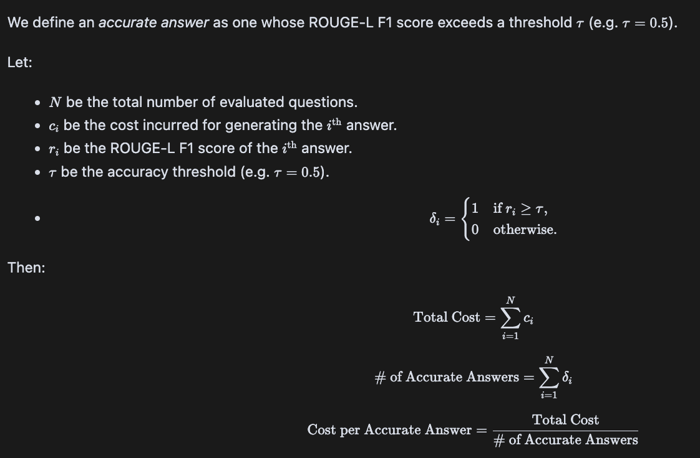
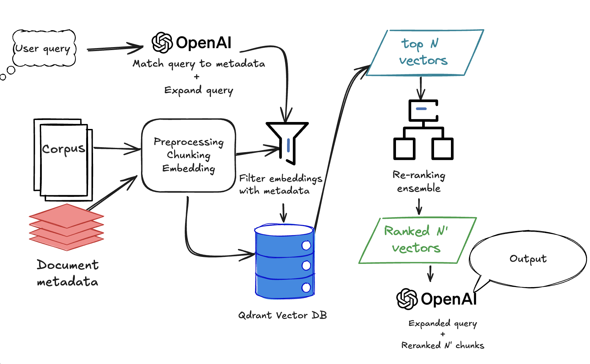

# Executive Summary

* **Goal** Create a RAG-based QA engine so staff can query massive documents (e.g., 40 k-token SEC 10-Ks) and get sourced answers in seconds.
* **Result** Our prototype beats closed-book GPT-4o on accuracy and slashes token spend:

  * Full-context GPT-4o ≈ $75 K /mo
  * Web-search GPT-4o ≈ $166 K /mo
  * **RAG pipeline ≈ \$3 K /mo → 97 % cheaper**
* **Tech stack** 150-token chunks → vector search → reranker → GPT-4o answer; evaluated on 300 Q-A pairs with ROUGE-L, BLEU, Recall\@k.
* **Key metric** Cost-per-accurate-answer; RAG wins by 25× vs. full-context.
* **Next moves** Expand corpus, add hierarchical retriever for higher recall, containerise for prod latency, and build a human-labelled QA test set.

**Bottom line:** RAG delivers regulator-grade answers at enterprise scale while keeping LLM costs and compliance risk low.

# Quick Start

## Running an Evaluation

To quickly evaluate the RAG pipeline performance, follow these steps:

### Prerequisites
```bash
# Install dependencies
poetry install

# Set up environment variables
export OPENAI_API_KEY="your-openai-api-key"
export HUGGINGFACE_TOKEN="your-hf-token"  # Optional, for downloading datasets
```

### Basic Evaluation
```bash
# Run evaluation with default settings (uses cached data if available)
python run_evaluation.py

# Run with specific configuration
python run_evaluation.py --config-name "rag_reranker" --max-questions 50
```

### Custom Evaluation
```bash
# Generate a new QA dataset first
python -m src.sec_insights.evaluation.generate_qa_dataset \
    --dataset-size 100 \
    --output-path data/qa_custom.json

# Run evaluation on custom dataset
python run_evaluation.py \
    --qa-dataset-path data/qa_custom.json \
    --config-name "rag_ensemble" \
    --max-questions 100
```

### Available Configurations
- `vanilla_rag`: Basic RAG with vector search
- `rag_reranker`: RAG with single reranker
- `rag_ensemble`: RAG with dual rerankers and query expansion
- `full_context`: GPT-4o with full document context (expensive)
- `web_search`: GPT-4o with web search capability

### Results
Results are saved to `data/results/` with timestamps. Key metrics include:
- **ROUGE-L**: Measures answer quality vs ground truth
- **BLEU**: Measures precision of generated text
- **Recall@k**: Measures retrieval effectiveness (RAG only)
- **Cost per accurate answer**: Primary business metric

### Example Output
```
Evaluation Results Summary:
========================
Method: rag_reranker
ROUGE-L: 0.742
BLEU: 0.681
Recall@5: 0.856
Cost per query: $0.0008
Total cost: $24.50
```

For detailed analysis, see the generated notebooks in `notebooks/evaluation.ipynb`.

# Problem Definition

A common need in most industries is to have an LLM that can answer questions about private or internal documents. Many of these can be long, unstructured, semantically dense, or have diverse vocabulary difficult to sort through manually. Without fine-tuned LLM, or a Retrieval-Augmented Generation (RAG) pipeline, users have limited options:

- They can upload the relevant document to an LLM, but this can be inaccurate, costly, and potentially create compliance issues
- They can do a keyword search to find the relevant passage in the text, but this can be inaccurate and potentially open the company up to compliance issues
- They can read through the document manually, but if there are potentially thousands of documents to sort through, it can be tedious and time consuming.

A common solution to these problems is for companies to create a RAG pipeline that can retrieve and summarize information relevant to the user queries. However, depending on implementation methodology this could have its own set of problems:

- **Cost**: High-context API calls can be expensive
- **Accuracy**: Vanilla RAG models tend to underperform, especially with data with lots of noise
- **Expertise**: Building and maintaining the system requires specialized skills/resources. It can be outsourced but creating an accurate model often requires specific domain knowledge that a consultant may not have.

**Problem statement**: How can we create a QA engine on specialized texts, while optimizing for cost and relevance of answers retrieved?

# Opportunity sizing
SEC filings are long, filled with boilerplate language, and often difficult to parse through even as an experienced analyst. Let's assume that I have the following question:

> "What were some of the risks outlined in Tesla's 2024 SEC filing?"

16 tokens.

For the sake of simplicity, let's assume the answer can be obtained with the following source:
- [TSLA 2024 10-K SEC filing](https://www.sec.gov/Archives/edgar/data/1318605/000162828025003063/tsla-20241231.htm#ie9fbbc0a99a6483f9fc1594c1ef72807_157), 83,000 tokens


To implement an architecture that could answer these questions, we have the following options.

- LLM with no context: Just ask the question directly and rely on training data to give us the answer.
- LLM with unfiltered context: Manually upload full context to LLM, have the LLM parse it for us and return the answer
- LLM with web search: Ask the question directly, and don't provide context.
- RAG: Embed chunks of the query and entire corpus of texts, match subset $N$ of the top $k$ chunks by their embedding similiarity, send those to the LLM along with the query.

There are lots of LLM's we could use, but let's assume that we're using GPT 4o mini at commercial API usage rates.

Using our document baseline, and assuming that each method can accurately answer the question, here are the daily cost extrapolations for a platform with the following levels of activity:

- We have a platform with 1000 concurrent users at any given moment
- These users use the platform for 10 hours per day
- Each user asks 1 question every 3 minutes, each similar to the above question (16 tokens).

That's 6,000,000 queries per month

| Scenario                                  | Cost per Query (USD)\* | Cost per 1 k Queries (USD) | Cost per 30-Day Month (USD)\*\* |
| ----------------------------------------- | --------------------- | -------------------------- | ------------------------------- |
| GPT-4o, **unfiltered 83 k-token context** | **\$0.01257**         | **\$12.57**                | **\$ 75 434.40**                |
| GPT-4o **+ web-search call**              | **\$0.02762**         | **\$27.62**                | **\$ 165 734.40**               |
| GPT-4o **no context / no search**         | **\$0.00012**         | **\$0.12**                 | **\$ 734.40**                   |
| **RAG pipeline** (2,516-token prompt)     | **\$0.00050**         | **\$0.50**                 | **\$ 2 984.40**                 |

A RAG is **97% cheaper** than an unfiltered call, and pennies compared to using GPT's web-search feature. And unlike the LLM-only options, we can optimize it to make it cheaper, more flexible, and more accurate.

| Scenario                           | High Accuracy | Cost Efficient | Low Latency | Scalable | Curated Sources |
|------------------------------------|----------------|----------------|-------------|----------|---------------------|
| GPT-4o with unfiltered context     | ✅             | ❌             | ❌          | ❌       | ✅                  |
| GPT-4o with web search             | ✅             | ✅             | ✅          | ✅       | ❌                  |
| GPT-4o without context             | ❌             | ✅             | ✅          | ✅       | ❌                  |
| RAG with semantic search (GPT-4o)  | ✅             | ✅             | ✅          | ✅       | ✅                  |

# Evaluation Criteria

We'll implement all scenarios above, and evaluate them on the following criteria:

- *How well does our engine answer questions about [SEC 10K filings](https://huggingface.co/datasets/virattt/financial-qa-10K)?*

We will use GPT 4 to generate 300 questions about the text, and ground the correct answer to a single chunk. We'll then evaluate each system on their ability
to locate the chunk, and use the key language from the chunk.

## Evaluation metrics

### Technical metrics

All models will be evaluated on ROUGE-L and BLEU. These are powerful complementary metrics, as ROUGE-L captures the presence of longer sequences of tokens that shows that an answer captures a topic end-to-end, while BLEU focuses on the precision of shorter n-grams, penalizing hallucination. Both capture n-gram overlap that matters for financial texts.

For RAG engines, we'll evaluate on Recall@k and nDCG@10.

Recall@k measures how many of our top k chunks returned have high relevance to the query. This helps us identify the point of diminishing returns so we can reduce the number of chunks we send to the LLM, and therefore save money without impacting accuracy.

Normalized Discounted Cumulative Grade at Rank 10, or nDCG@10, measures the ranking of the top 10 vectors returned. If the top 10 vectors returned are all relevant, and all sorted in descending order, then the score is 1.0. The higher the score, the fewer vectors we need to send to the LLM, the more savings opportunities.

### Business metric

Our primary business metric will be **cost per accurate answer**, CPAA.

This helps balance our model accuracy with cost.

# Dataset Sourcing

To build a proof of concept of a QA engine optimized for precision and cost, I chose to use the [JanosAudran/financial-reports-sec](https://huggingface.co/datasets/JanosAudran/financial-reports-sec) dataset from HuggingFace. This includes the annual SEC filings of publicly listed companies in the US.

I chose this dataset because:
1. The dataset is already split into sentences and labeled by semantic section; this limits the data cleaning necessary.
2. The dataset has limited noise; much of the language is boilerplate or using finance domain terms. This is good in that it limits cleaning requirements, but  creates a challenge for the RAG to get the right answer from a large database semantically similar phrases.
3. We can leverage finance domain specific models, of which there are many.


While this dataset comes pre-processed in a way that most real-world practitioners don't have the luxury of receiving, for the purposes of this exercise I'm skipping most pre-processing.

Note that for the purpose of this exercise in order to limit computational requirements and the API costs, I chose to only include 5 companies: Apple, Tesla, Meta, Nvidia, and Amazon, and only the years 2012-2020 (the only years for which I could find structured data for all companies).

I chose similar companies because I want the documents to be relatively similar. Since they're all tech companies, if one of the words in the query is "GPU" or "AI" or "computers", it's not necessarily correlated with one specific company. However, if the query asks about an oil company, for exmaple, since there would only be one oil company in the dataset the query would automatically have a higher cosine similarity score. However this does mean that the results we get from this model might not be transferrable to all industries.

# Approach and Pipeline

My approach to creating an efficient, precise, and cost-effective QA engine is to implement several baselines alongside a few different implementations of RAG pipelines.
| Model                                      | Evaluation Use | Implementation                                                                                                                                                                                                                                     | Advantages                                                                                                                                                        | Disadvantages                                                                                                           |
|-------------------------------------------|----------------|----------------------------------------------------------------------------------------------------------------------------------------------------------------------------------------------------------------------------------------------------|-------------------------------------------------------------------------------------------------------------------------------------------------------------------|------------------------------------------------------------------------------------------------------------------------|
| **Vanilla gpt-4o-mini**                   | Baseline       | Send question about a company’s SEC filing directly into the API. Provide no context.                                                                                                                                                             | - Cheap  <br> - Extremely easy to set up                                                                                                                          | - Only has access to training data  <br> - Low precision  <br> - Prone to hallucinations                              |
| **gpt-4o-mini with full context**         | Baseline       | Send question and the full SEC filing document as context                                                                                                                                                                                         | - Curated content  <br> - Computationally efficient                                                                                                               | - Extremely expensive, impractical at scale  <br> - Hallucinations start to increase at ≥8k tokens                    |
| **gpt-4o-mini-websearch-preview**         | Baseline       | Send question into the engine, and allow it to search the web for the correct information                                                                                                                                                         | - Can access publicly available data  <br> - Computationally efficient                                                                                            | - Expensive  <br> - Prone to bias of web sources  <br> - Difficult to curate sources                                  |
| **Vanilla RAG + gpt-4o-mini**             | Experimental   | - Chunk corpus  <br> - Get embeddings with `text-embedding-3-small`  <br> - Extract metadata from text  <br> - Store embeddings in vector DB  <br> - Get cosine similarity between query and matching vectors, return top N passages  <br> - Feed top N passages into LLM  <br> - LLM returns answer | - Cheap  <br> - Computationally efficient  <br> - Provides significant increases to precision at a similar cost              | - Requires more infrastructure                                                                                         |
| **RAG with reranker**                     | Experimental   | Same as vanilla RAG, except a reranking model returns a logit probability of passage-to-query relevance, and sorts in descending order                                                                     | - Significantly improves relevance over vanilla RAG  <br> - Same cost as vanilla RAG                                        | - Requires more infrastructure  <br> - Inference is slower than other options                                          |
| **RAG with reranker ensemble + query expansion** | Experimental   | - Same as RAG with reranker, plus:  <br> - LLM expands the query before embedding  <br> - First reranker selects subset N’  <br> - Second reranker filters N’ to N’’  <br> - LLM answers based on N’’                                           | - Improves relevance over single reranker  <br> - Supports domain-specific reranking  <br> - Handles vague or sloppy user input | - Slower inference  <br> - More compute/infrastructure required  <br> - More expensive due to extra API calls         |

See the RAG with reranker(s) flow below:



# Implementation

For details of EDA and implementation, see the following notebooks:

- [EDA](./notebooks/EDA.ipynb)
- [Implementation details](./notebooks/implementation.ipynb)
- [Results analysis](./notebooks/evaluation.ipynb)

# Next iterations

## Accuracy improvements
A recent paper by [Huang et al, 2025](https://arxiv.org/pdf/2503.10150) introduced a new methodology for graph based hierarchical knowledge modeling for retrieval pipelines that could be useful for our system. It could help us increase recall and decrease context sent to LLM's, therefore limiting costs.

The reranking ensemble we've used is also a relatively vanilla setup. There are higher parameter models that we could use to increase our ranking efficacy.

## New features

Ideally we utilize multiple sources of text. Ideally we could ask the question

> "What were the reported earnings in META's 2019 10K filing, and how did the media respond after earnings calls? How did the stock change in the upcoming 24 hours?"

This would require integrating multiple API's and having a different evaluation process. The costs would be higher as well, but the possibility of having a potentially infinite number of data sources curated and catalogued, and ready for our users to query is an exciting prospect.

OpenAI's web-search API, while performing abysmally in this iteration, could be a premium feature that we could develop and iterate upon, as long as we can control the model's variability.

# Current limitations

If our goal is to implement a RAG pipeline for SEC 10-K filings, we have developed a thorough proof of concept, but we're nowhere near ready for production.

## Limited evaluation data

Due to computational restrictions (not testing on the cloud), we've only evaluated our pipeline on a very narrow set of documents. Specifically, tech companies between the years of 2012-2020. We can't guarantee that the same methodology we're using for our PoC will transfer to other domains. In other words, if we ask it questions about oil companies, or feed it documents from the European Commission instead of the US FEC, we can't guarantee the same results. Furthermore, the data we used for our proof of concept is already clean, and we'll need to spend time and resources creating an appropriate pipeline that will structure the data in a stable and efficient way.

## Limited validation sets

The way we judge the accuracy of the model currently is based off LLM QA generation with limited human oversight. The questions we've currently evaluated our model on might not be the same types of questions that our users would actually ask on a daily basis. In order to ensure that we're evaluating the quality of our model, we need to get buy-in from business stakeholders to help either create a labeled QA set, or at least review an LLM-generated one. This will give us more confidence in our metrics.

## Latency issues

Our current implementation is theoretical and academic; we still have a lot of infrastructure work to do before we can put it into production. This includes:
- Containerizing the model for a cloud environment (ideally a VM with persistent storage)
- Latency testing to ensure that the multiple API/transformer/embedding model calls aren't going to have a negative impact on the user experience
- We're currently heavily dependent on OpenAI. There are likely other models more suited for our use case that we haven't explored, including hosting our own fine-tuned models for only the cost of GPU compute time.
- Load testing to ensure that the system will work at scale

## Limited amount of data sets

Currently we're only getting the public datasets of the SEC 10-K filings. This might not be enough features to satisfy our users or business stakeholders
