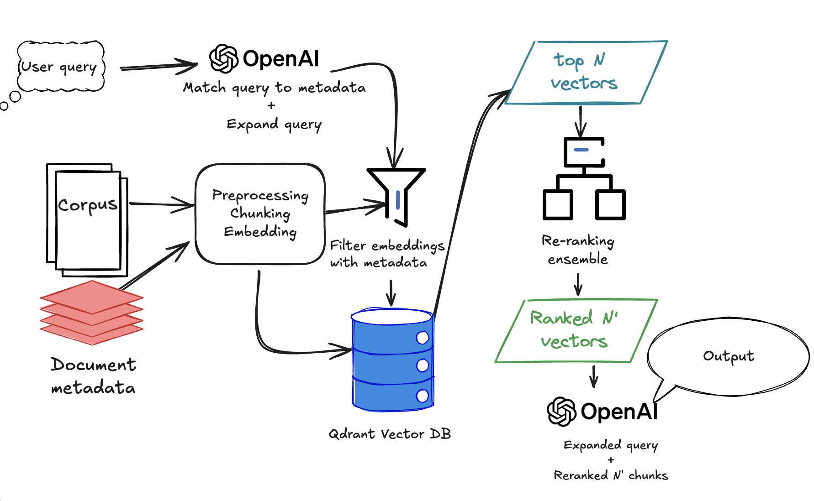

# Problem Definition
A common need in most industries is to have an LLM that can answer questions about private or internal documents. Many of these can be long, unstructured, semantically dense, or have diverse vocabulary difficult to sort through manually. Without fine-tuned LLM, or a Retrieval-Augmented Generation (RAG) pipeline, users have limited options:

- They can upload the relevant document to an LLM, but this can be inaccurate, costly, and potentially create compliance issues
- They can do a keyword search to find the relevant passage in the text, but this can be inaccurate and potentially open the company up to compliance issues
- They can read through the document manually, but if there are potentially thousands of documents to sort through, it can be tedious and time consuming. 

A common solution to these problems is for companies to create a RAG pipeline that can retrieve and summarize information relevant to the user queries. However, depending on implementation methodology this could have its own set of problems:

- **Cost**: High-context API calls can be expensive
- **Accuracy**: Vanilla RAG models tend to underperform, especially with data with lots of noise
- **Expertise**: Building and maintaining the system requires specialized skills/resources. It can be outsourced but creating an accurate model often requires specific domain knowledge that a consultant may not have. 

**Problem statement**: How can we create a QA engine on specialized texts, while optimizing for cost and relevance of answers retrieved?

# Dataset Sourcing

To build a proof of concept of a QA engine optimized for precision and cost, I chose to use the [JanosAudran/financial-reports-sec](https://huggingface.co/datasets/JanosAudran/financial-reports-sec) dataset from HuggingFace. This includes the annual SEC filings of publicly listed companies in the US. 

I chose this dataset because:
1. The dataset is already split into sentences and labeled by semantic section; this limits the data cleaning necessary. 
2. The dataset has limited noise; much of the language is boilerplate or using finance domain terms. This is good in that it limits cleaning requirements, but  creates a challenge for the RAG to get the right answer from a large database semantically similar phrases.
3. We can leverage finance domain specific models, of which there are many. 

While this dataset comes pre-processed in a way that most real-world practitioners don't have the luxury of receiving, for the purposes of this exercise I'm skipping most pre-processing. 

Note that for the purpose of this exercise in order to limit computational requirements and the API costs, I chose to only include 5 companies: Apple, Tesla, Meta, Nvidia, and Amazon, and only the years 2012-2020 (the only years for which I could find structured data for all companies). 

I chose similar companies because I want the documents to be relatively similar. Since they're all tech companies, if one of the words in the query is "GPU" or "AI" or "computers", it's not necessarily correlated with one specific company. However, if the query asks about an oil company, for exmaple, since there would only be one oil company in the dataset the query would automatically have a higher cosine similarity score. However this does mean that the results we get from this model might not be transferrable to all industries. 

# Approach and Pipeline

My approach to creating an efficient, precise, and cost-effective QA engine is to implement several baselines alongside a few different implementations of RAG pipelines. 
| Model                                      | Evaluation Use | Implementation                                                                                                                                                                                                                                     | Advantages                                                                                                                                                        | Disadvantages                                                                                                           |
|-------------------------------------------|----------------|----------------------------------------------------------------------------------------------------------------------------------------------------------------------------------------------------------------------------------------------------|-------------------------------------------------------------------------------------------------------------------------------------------------------------------|------------------------------------------------------------------------------------------------------------------------|
| **Vanilla gpt-4o-mini**                   | Baseline       | Send question about a company’s SEC filing directly into the API. Provide no context.                                                                                                                                                             | - Cheap    - Extremely easy to set up                                                                                                                          | - Only has access to training data    - Low precision    - Prone to hallucinations                              |
| **gpt-4o-mini with full context**         | Baseline       | Send question and the full SEC filing document as context                                                                                                                                                                                         | - Curated content    - Computationally efficient                                                                                                               | - Extremely expensive, impractical at scale    - Hallucinations start to increase at ≥8k tokens                    |
| **gpt-4o-mini-websearch-preview**         | Baseline       | Send question into the engine, and allow it to search the web for the correct information                                                                                                                                                         | - Can access publicly available data    - Computationally efficient                                                                                            | - Expensive    - Prone to bias of web sources    - Difficult to curate sources                                  |
| **Vanilla RAG + gpt-4o-mini**             | Experimental   | - Chunk corpus    - Get embeddings with `text-embedding-3-small`    - Extract metadata from text    - Store embeddings in vector DB    - Get cosine similarity between query and matching vectors, return top N passages    - Feed top N passages into LLM    - LLM returns answer | - Cheap    - Computationally efficient    - Provides significant increases to precision at a similar cost              | - Requires more infrastructure                                                                                         |
| **RAG with reranker**                     | Experimental   | Same as vanilla RAG, except a reranking model returns a logit probability of passage-to-query relevance, and sorts in descending order                                                                     | - Significantly improves relevance over vanilla RAG    - Same cost as vanilla RAG                                        | - Requires more infrastructure    - Inference is slower than other options                                          |
| **RAG with reranker ensemble + query expansion** | Experimental   | - Same as RAG with reranker, plus:    - LLM expands the query before embedding    - First reranker selects subset N’    - Second reranker filters N’ to N’’    - LLM answers based on N’’                                           | - Improves relevance over single reranker    - Supports domain-specific reranking    - Handles vague or sloppy user input | - Slower inference    - More compute/infrastructure required    - More expensive due to extra API calls         |

See the RAG with reranker(s) flow below:

# Implementation

For details of EDA and implementation, see the following notebooks:

[EDA](./notebooks/EDA.ipynb)

# Evaluation
For evaluation of results, I'll use an ensemble of metrics:

##Primary metric: Cost per accurate answer
### Cost per Accurate Answer

We define an *accurate answer* as one whose ROUGE-L F1 score exceeds a threshold $\tau$ (e.g., $\tau = 0.5$).

Let:

- $N$ be the total number of evaluated questions.
- $c_i$ be the cost incurred for generating the $i^{\text{th}}$ answer.
- $r_i$ be the ROUGE-L F1 score of the $i^{\text{th}}$ answer.
- $\tau$ be the accuracy threshold of 0.5
- $\delta_i = \begin{cases}
1 & \text{if } r_i \geq \tau \\
0 & \text{otherwise}
\end{cases}$ — indicator for an accurate answer.

Then:

$$
\text{Total Cost}  = \sum_{i=1}^N c_i
$$

$$
\text{\# of Accurate Answers} = \sum_{i=1}^N \delta_i
$$

$$
\text{Cost per Accurate Answer} = 
\frac{\text{Total Cost}}{\text{\# of Accurate Answers}}
$$

## Secondary metrics
- Rouge L - Longest common subsequence
    - Best for factual QA, rewards both accuracy and completeness
- Recall@k $k \in  \{1,3,5,7,10\}$ (only for RAG)
    - Helps evaluate the value of k vectors to return to the LLM to balance accuracy and cost
- NDCG@10 (only for RAG)
    - Normalized Discounted Cumulative Gain @ rank 10. It measures not only whether or not the correct answer was returned, but how highly it ranked. 

# Recommendations